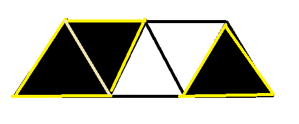
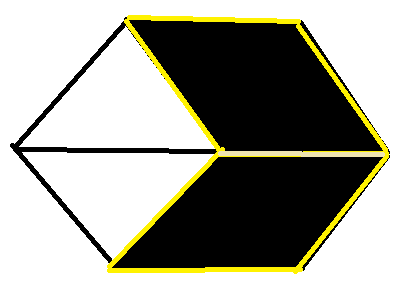

# CCC '23 J4/S1

[Jump to summary.](#summary)

## Analysis

The subtasks for this problem provide a good avenue of approach.

First, let us consider the first subtask. The second row is fully white and
black tiles are never adjacent, so it suffices to **add $3$ meters of warning
tape — one meter on each side of the triangle — for each black tile in the first
row.**

Now, let's generalize this to the second subtask. Where does our previous
solution fail? Consider the following scenario:



If we add $3$ meters of warning tape for each black triangle, then we'd end up
with $3 + 3 + 3 = 9$ meters in total. However, we only need $7$ meters, as two
of the black triangles share a side (shown in light yellow) that need not be
surrounded with warning tape. To account for this, we can **subtract $2$ meters of
tape for each adjacent pair of triangles.**

We are now close to a full solution. All that remains is to generalize to two rows
instead of one. Again, let's try to see where our previous solution fails when we add
on the bottom row. Take the following scenario:



Here, adding $3$ meters for each triangle and subtracting $2$ for each pair of
adjacent black triangles on the same row gives us $3 + 3 - 2 + 3 + 3 - 2 = 8$
meters of tape total, whereas the expected answer is $6$ — we don't need tape
for the side shown in light yellow. Similar to the previous subtask, we can
account for this by **subtracting $2$ meters of tape for each pair of black
triangles on the top and bottom row that have a shared base.**

## Summary

In sum, here is the flow of the solution:

1. Add 3 meters of tape for each black triangle on the top and bottom row.
2. Subtract 2 meters of tape for each pair of adjacent black triangles on the same row.
3. Subtract 2 meters of tape for each pair of black triangles sharing a base.

## Implementation

```py
def calc(row):
    tape = row[0] * 3
    for prev, cur in zip(row, row[1:]):
        if cur:
            tape += 3 - 2 * prev
    return tape


n = int(input())
top_row = list(map(int, input().split()))
bot_row = list(map(int, input().split()))

tape = calc(top_row) + calc(bot_row)
for t, b in zip(top_row[::2], bot_row[::2]):
    if t and b:
        tape -= 2
print(tape)
```
