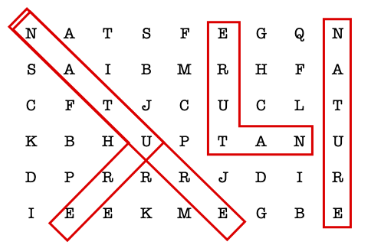
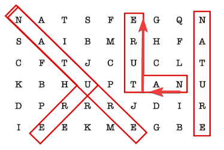

# CCC '23 J5

## Analysis

The key thing to note is that the constraints are low — the grid is at most 100
by 100 and the word 26 letters — so a brute-force solution will suffice.

First consider the easier case, where there are no perpendicular line segments.
For each letter in the grid, check if it matches the first letter of the word.
If so, **try going in all eight directions, checking to see if we can match the
next leter of the word**. For example, to check the upward direction only,

```py
# input reading elided

def match_up(i, j):
	for w in word:
		if i < 0 or i >= r or j < 0 or j >= c or grid[i][j] != w:
			return False
		i -= 1 # move up
	return True

ans = 0
for i in range(r):
	for j in range(c):
		if match_up(i, j):
			ans += 1
```

Adding code to handle the remaining directions yields a solution that solves the
first 3 subtasks.

Now, consider the case where the word can appear on two perpendicular line
segments. We can reformulate the problem: instead of trying to match one word on
two perpendicular line segments, try to match a prefix of the word on one line
segment. Then, on a perpendicular line segment starting at the end of the first,
try to match the remaining part of the word.

For example, taking the second sample input,



To find the solution shaped like an `L`, match `NA` going right. Then, match
`TURE` going up.



Combining this idea with the code for the first three subtasks gives a full
solution.

## Implementation

```py
from collections import namedtuple

# should be a dataclass, but CCC Grader uses an old Python version
Dir = namedtuple("Dir", ["r_offset", "c_offset"])

# sorted in clockwise order, so directions two indices away from each other will
# be perpendicular
dirs = [
    Dir(-1, 0),
    Dir(-1, 1),
    Dir(0, 1),
    Dir(1, 1),
    Dir(1, 0),
    Dir(1, -1),
    Dir(0, -1),
    Dir(-1, -1),
]

word = input()
n = int(input())
m = int(input())
grid = []
for _ in range(n):
    grid.append(input().split())


def match(i, j, word, d):
    for c in word:
        if i < 0 or i >= n or j < 0 or j >= m or grid[i][j] != c:
            return None
        else:
            i += d.r_offset
            j += d.c_offset
    return i, j


ans = 0
for i in range(n):
    for j in range(m):
        # one direction only
        for d in dirs:
            if match(i, j, word, d):
                ans += 1

        # go in one direction then turn and go in perpendicular direction
        for turn_at in range(1, len(word) - 1):
            for d_i, d in enumerate(dirs):
                for perp_d in (dirs[(d_i + 2) % 8], dirs[(d_i - 2) % 8]):
                    pos = match(
                        i, j, word[:turn_at], d
                    )  # position after matching first part of word
                    if pos and match(pos[0], pos[1], word[turn_at:], perp_d):
                        ans += 1
print(ans)
```
